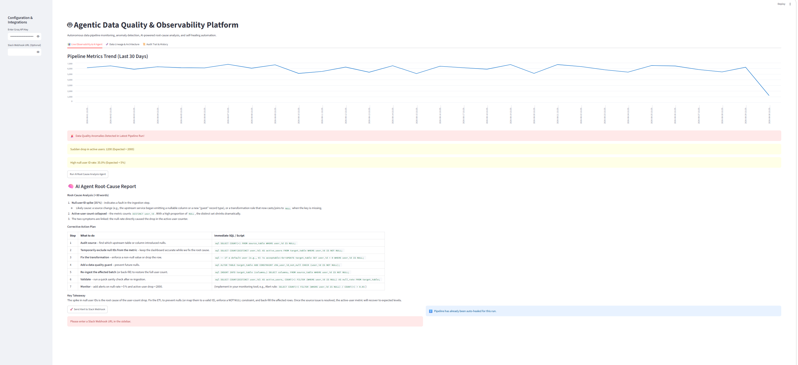

# 🤖 Agentic Data Quality & Observability Platform

  
  
  
  

An enterprise-grade autonomous data observability platform built with **Streamlit**, designed for real-time pipeline monitoring, AI-powered root-cause analysis, data lineage visualization, automated self-healing, and webhook alerting.

## 📸 Platform UI Preview

## 🚀 Key Features
- **Interactive Streamlit Dashboard:** A clean, multi-tab web application providing end-to-end data pipeline visibility.
- **Live Anomaly Detection:** Continuously tracks core pipeline metrics (Active Users, Null User ID rates) and flags data quality issues instantly.
- **AI-Powered Root-Cause Analysis:** Leverages LLM agents via Groq API to analyze logs, inspect schema changes, and write corrective SQL action plans.
- **Auto-Remediation (Self-Healing):** Executes automated pipeline patches and fallback recovery mechanisms with a single click.
- **Data Lineage Architecture:** Visualizes upstream dependencies and data flow from source databases to analytics marts using Mermaid.js.
- **Slack Webhook Integration:** Dispatches automated incident alerts and AI diagnostic reports directly to team communication channels.
- **Immutable Audit Trail:** Logs all pipeline anomalies, AI decisions, and remediation statuses for compliance.

## 🛠️ Tech Stack & Architecture
- **Frontend & UI:** Streamlit
- **AI Intelligence:** Groq API (LLMs)
- **Data Processing:** Pandas
- **Visualization:** Native Streamlit Charts & Mermaid.js Data Lineage